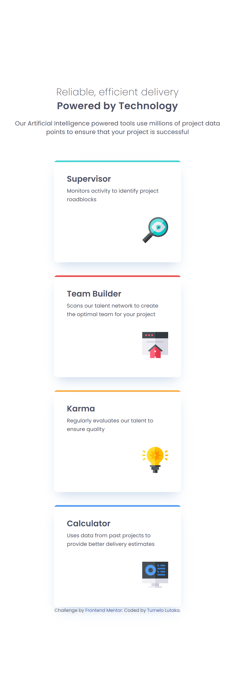
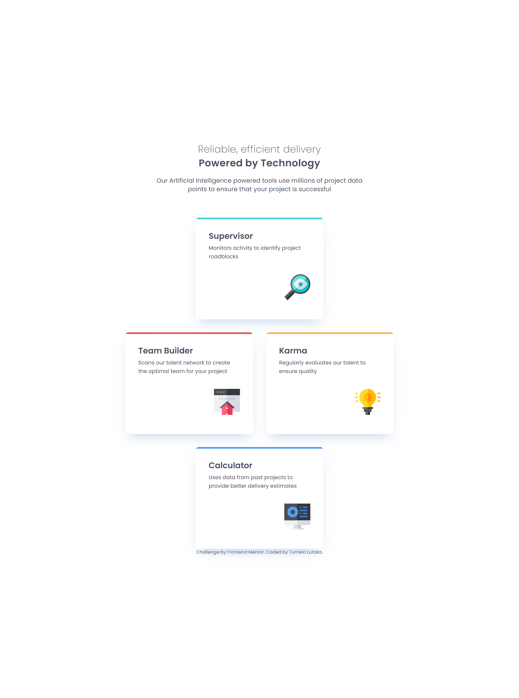
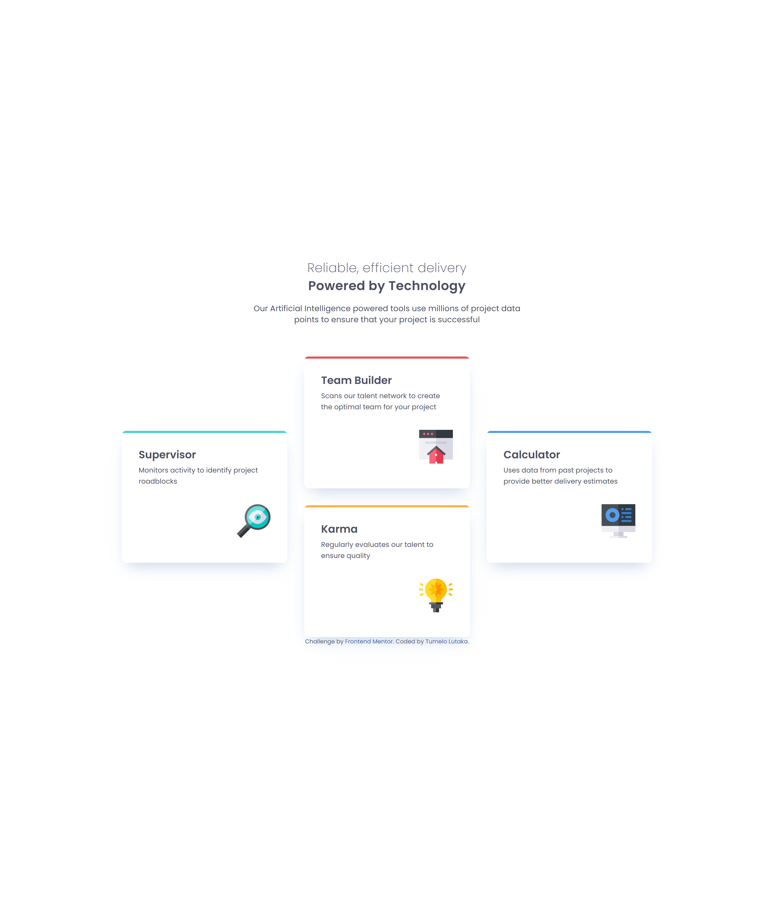

# Frontend Mentor - Four card feature section solution

This is a solution to the [Four card feature section challenge on Frontend Mentor](https://www.frontendmentor.io/challenges/four-card-feature-section-weK1eFYK). Frontend Mentor challenges help you improve your coding skills by building realistic projects.

## Table of contents

- [Overview](#overview)
  - [The challenge](#the-challenge)
  - [Screenshot](#screenshot)
  - [Links](#links)
- [My process](#my-process)
  - [Built with](#built-with)
  - [What I learned](#what-i-learned)
  - [Continued development](#continued-development)
- [Author](#author)

**Note: Delete this note and update the table of contents based on what sections you keep.**

## Overview

### The challenge

Users should be able to:

- View the optimal layout for the site depending on their device's screen size

### Screenshot





### Links

- Solution URL: https://github.com/TumeloLutaka/four-card-feature-section/
- Live Site URL: https://tumelolutaka.github.io/four-card-feature-section/

## My process

### Built with

- Semantic HTML5 markup
- CSS custom properties
- Flexbox
- CSS Grid
- Mobile-first workflow
- CSS Media Queries

### What I learned

The major learnings and take aways from this project came mostly from the CSS grid and it's various properties. Specifically learning how row and columns interacted and could be stretched to encompasses other grid cells. An example of this is shown in the code below.

```css
.card:nth-child(1),
.card:nth-child(4) {
  grid-column: 1 / -1; /* span full width */
  justify-self: center;
}
``` 

### Continued development

In future projects and future learning in general, I want to focus on truly understanding the inner workings of the grid and it's various properties. I can appreciate how powerful of a tool it could be in helping my layouts and responsive implementations.

## Author

- Frontend Mentor - [@TumeloLutaka](https://www.frontendmentor.io/profile/TumeloLutaka)
- Github - [@TumeloLutaka](https://github.com/TumeloLutaka)
